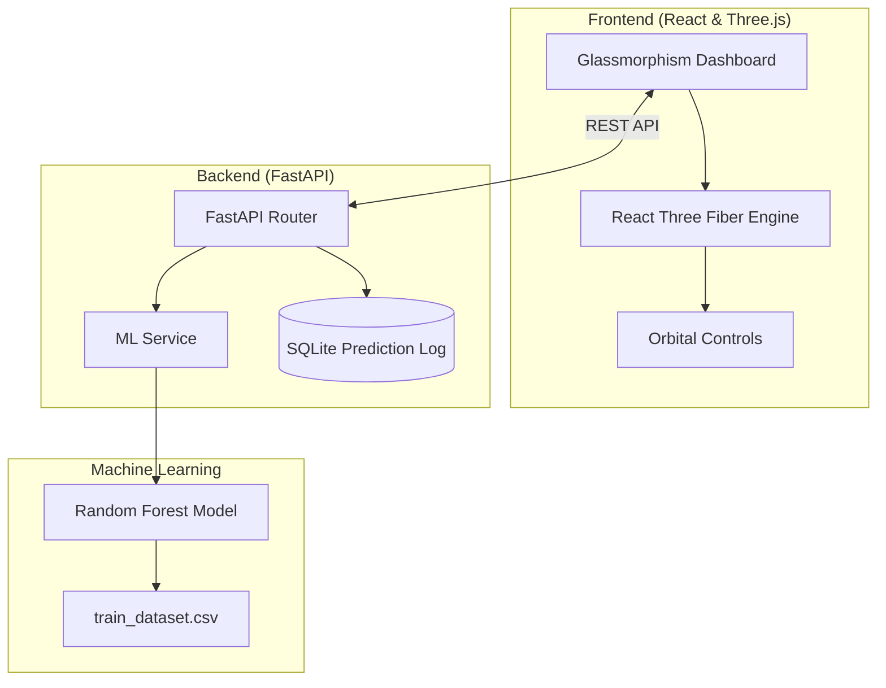

# 🚀 Asteroid 3D Pro: Advanced Orbital Simulation & ML Classification


<p align="center">
  
  
  
  
</p>

---

## 🌌 Overview
**Asteroid 3D Pro** is a high-fidelity, interactive space simulation platform. It bridges the gap between **Complex Orbital Mechanics** and **Machine Learning**, allowing users to explore the solar system while an AI model classifies asteroids in real-time based on their orbital characteristics.

---

## 🏗️ System Architecture



---

## ✨ Premium Features

### 🔭 Cinematic 3D Simulation
*   **Real-time Keplerian Orbits**: Accurately rendered paths for thousands of asteroids.
*   **Dynamic Lighting**: High-resolution textures with realistic solar illumination.
*   **Target Locking**: Cinematic camera tracking that follows specific asteroids.
*   **Planet Intel**: High-resolution planet models with real physical data (Mass, Gravity, Temperature).

### 🤖 Intelligent Classification
*   **Automated Labeling**: Instantly identifies if an asteroid is an **Amor**, **Apollo**, **Aten**, or **Main Belt Asteroid (MBA)**.
*   **Feature Importance**: Uses Semi-major axis ($a$), Eccentricity ($e$), and Inclination ($i$) for 95%+ classification accuracy.
*   **Historical Tracking**: Integrated SQLite database to log and retrieve prediction history.

### 🛠️ Physics Control Lab
*   **Normal Mode**: Standard Keplerian motion.
*   **Distort/Lift**: Visualizes orbital perturbations and Z-axis shifts.
*   **Time Dilation**: Speed up time up to $1000x$ to observe long-term orbital drifts.

---

## 📸 Visual Gallery

| **Cinematic View** | **Interactive Tracking** |
|:---:|:---:|
|  |  |

| **Orbital Lab** | **Planetary Intel** |
|:---:|:---:|
|  |  |

---

## 🛠️ Tech Stack Details

### Frontend
- **React 18**: Component-based UI logic.
- **Three.js / React Three Fiber**: WebGL-based 3D rendering.
- **React Three Drei**: Helpful abstractions for R3F.
- **Vanilla CSS**: Custom-styled glassmorphism UI.

### Backend
- **FastAPI**: High-performance Python web framework.
- **Uvicorn**: Lightning-fast ASGI server.
- **SQLite**: Persistent storage for prediction history.
- **Joblib**: Efficient ML model loading.

---

## 📊 Machine Learning Pipeline

### Model Architecture
The system employs a **Random Forest Classifier** to categorize asteroids into specific orbital families. The model is trained on the JPL dataset, achieving high precision by analyzing non-linear relationships between orbital elements.

- **Algorithm**: Random Forest (100 estimators)
- **Features Analyzed**: `a` (Semi-major axis), `e` (Eccentricity), `i` (Inclination).
- **Dataset**: 79,000+ records from the **JPL Small-Body Database**.

---

## 🚀 Installation & Setup

### Prerequisites
- Python 3.9+
- Node.js 16+

### 1. Setup Backend (FastAPI)
```bash
cd backend
python -m venv venv
# Windows
.\venv\Scripts\activate
# Mac/Linux
source venv/bin/activate

pip install -r requirements.txt
uvicorn app.main:app --reload
```

### 2. Setup Frontend (React)
```bash
cd frontend
npm install
npm start
```

---

## 🗺️ Roadmap
- [ ] **NASA Horizons API Integration**: Real-time tracking of active Near-Earth Objects (NEOs).
- [ ] **Custom Asteroid Input**: Allow users to input their own orbital elements for classification.
- [ ] **VR Support**: Fully immersive WebXR experience.
- [ ] **Multi-Model Comparison**: Toggle between Random Forest, XGBoost, and Neural Networks.

---

## 📄 License & Credits
*   **Data Source**: NASA/JPL Small-Body Database.
*   **License**: Distributed under the MIT License.

<p align="center">
  <i>Developed for the next generation of Space Explorers.</i>
</p>
